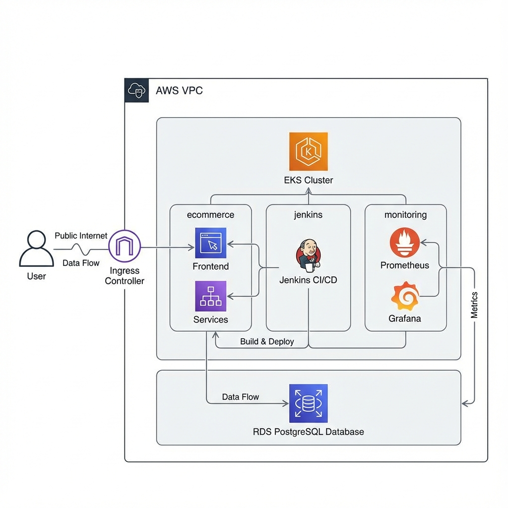

# 🛒 E-Commerce Microservices Architecture on AWS EKS

This project demonstrates a production-grade, highly available microservices application deployed on **AWS Elastic Kubernetes Service (EKS)**. It features a complete CI/CD pipeline, automated infrastructure provisioning, and a robust monitoring stack.

---

## 🏛️ Project Architecture



A detailed technical breakdown of the architecture, including the AWS infrastructure, Kubernetes namespaces, and data flow, can be found in the [Architecture Documentation](file:///C:/Users/DELL/.gemini/antigravity/brain/c335fe22-333f-4c8c-9b1f-25bd922457ae/architecture.md).

---

## 🏗️ Architecture Overview

The system is designed with **High Availability (HA)** in mind, running a total of **6 replicas** (2 per service) to ensure zero downtime.

### 🌐 System Components

1.  **Frontend**: React.js application served by Nginx.
2.  **Product-Service**: Node.js/Express API for managing product catalogs.
3.  **Order-Service**: Node.js/Express API for handling customer orders and transactions.
4.  **Database**: Managed **AWS RDS (MySQL)** for persistent storage.

### 🏛️ Infrastructure & DevOps Stack

- **Infrastructure as Code**: Terraform (VPC, EKS, RDS, Security Groups).
- **Container Orchestration**: AWS EKS (Managed Kubernetes).
- **CI/CD Pipeline**: Jenkins running inside the cluster.
  - **Kaniko**: Used for secure, daemonless Docker image builds inside Kubernetes.
  - **RBAC**: Custom ClusterRoles for secure Jenkins-to-EKS communication.
- **Monitoring**:
  - **Prometheus**: Real-time metric scraping.
  - **Grafana**: Custom dashboards for service health and traffic load.

---

## 🚀 Getting Started

### 1. Provision Infrastructure

Deploy the network, database, and cluster using Terraform:

```bash
cd terraform
terraform init
terraform apply -auto-approve
```

### 2. Configure Jenkins CI/CD

The pipeline is defined in `jenkins/Jenkinsfile_EKS.groovy`.

- **Secret Setup**: Add `dockerhub-credentials` to Jenkins.
- **RBAC Fix**: Apply the agent permissions to allow Jenkins to manage the cluster:
  ```bash
  kubectl apply -f kubernetes/jenkins/agent-permission.yaml
  ```

### 3. Deploy the Application

Trigger the Jenkins pipeline to:

1.  Build Docker images using **Kaniko**.
2.  Push images to Docker Hub.
3.  Deploy to the `ecommerce` namespace with a Rolling Update strategy.

---

## 📊 Monitoring & Observability

Access the monitoring stack in the `monitoring` namespace:

- **Prometheus**: Scrapes metrics from backend services every 15 seconds.
- **Grafana**: Visualizes the system health.

  - **Dashboard**: `E-Commerce Microservices Dashboard`
  - **Key Metric**: **Traffic Load (Backend CPU)** - Uses CPU usage rates as a proxy for real-time traffic activity.
  - **High Availability Check**: Displays **6 Active Instances** (2 Frontend + 2 Product + 2 Order).

- **AWS CloudWatch**: Used for hardware and infrastructure-level monitoring.
  - **Dashboard**: `ecommerce-dashboard`
  - **URL**: [CloudWatch Dashboard Link](https://us-east-1.console.aws.amazon.com/cloudwatch/home?region=us-east-1#dashboards:name=ecommerce-dashboard)
  - **Key Metrics**: RDS CPU Utilization, Database Connections, and Storage Health.

---

## 🛠️ Key Technical Solutions

| Problem                            | Solution                                                                              |
| :--------------------------------- | :------------------------------------------------------------------------------------ |
| **No Docker Daemon in EKS**        | Implemented **Kaniko** for building images without a host socket.                     |
| **Jenkins Permission Denied**      | Created a custom **ClusterRoleBinding** for the Jenkins Agent.                        |
| **Infrastructure Metric Blocking** | Switched dashboard to use **Application-level CPU metrics** for traffic visibility.   |
| **Service Visibility**             | Added specialized **Prometheus Annotations** to all deployments (including Frontend). |

---

## 🧹 Cleanup

To avoid AWS costs, destroy all resources when finished:

```bash
terraform destroy -auto-approve
```

---

_Developed as part of a DevOps & Microservices Specialization._
