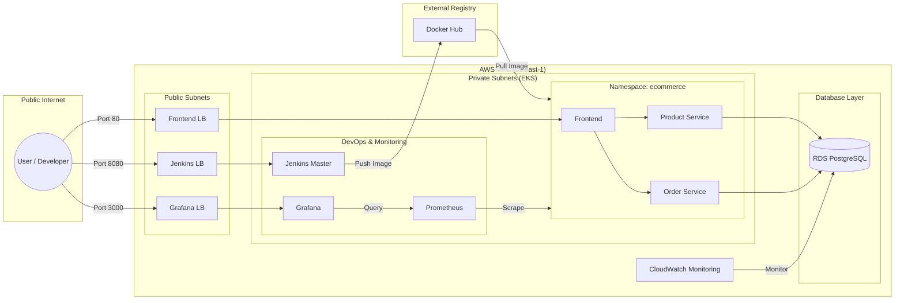

# 🛒 E-Commerce Microservices Architecture on AWS EKS

This project demonstrates a production-grade, highly available microservices application deployed on **AWS Elastic Kubernetes Service (EKS)**. It features a complete CI/CD pipeline, automated infrastructure provisioning, and a robust monitoring stack.

---

## 🏛️ Project Architecture


### 📊 Rendered Mermaid Diagram (Editable)



A detailed technical breakdown of the architecture, including the AWS infrastructure, Kubernetes namespaces, and data flow, can be found in the [Architecture Documentation](file:///C:/Users/DELL/.gemini/antigravity/brain/c335fe22-333f-4c8c-9b1f-25bd922457ae/architecture.md).

---

## 🏗️ Architecture Overview

The system is designed with **High Availability (HA)** in mind, running a total of **6 replicas** (2 per service) to ensure zero downtime.

### 🌐 System Components

1.  **Frontend**: React.js application served by Nginx.
2.  **Product-Service**: Node.js/Express API for managing product catalogs.
3.  **Order-Service**: Node.js/Express API for handling customer orders and transactions.
4.  **Database**: Managed **AWS RDS (MySQL)** for persistent storage.

### 🏛️ Infrastructure & DevOps Stack

- **Infrastructure as Code**: Terraform (VPC, EKS, RDS, Security Groups).
- **Container Orchestration**: AWS EKS (Managed Kubernetes).
- **CI/CD Pipeline**: Jenkins running inside the cluster.
  - **Kaniko**: Used for secure, daemonless Docker image builds inside Kubernetes.
  - **RBAC**: Custom ClusterRoles for secure Jenkins-to-EKS communication.
- **Monitoring**:
  - **Prometheus**: Real-time metric scraping.
  - **Grafana**: Custom dashboards for service health and traffic load.

---

## 🚀 Implementation Guide (Step-by-Step ETPs)

Follow these steps to deploy the entire environment from scratch.

### Step 1: Infrastructure Provisioning (Terraform)

Deploy the core networking, EKS cluster, and RDS database.

```bash
cd terraform
# Initialize and apply
terraform init
terraform apply -auto-approve
```

### Step 2: Kubernetes CLI Configuration

Configure your local machine to communicate with the new EKS cluster.

```bash
aws eks update-kubeconfig --region us-east-1 --name ecommerce-cluster
```

### Step 3: Core Namespace & RBAC Setup

Create the necessary isolation and grant Jenkins the permissions to manage resources.

```bash
# Create Namespaces
kubectl apply -f kubernetes/namespace.yaml

# Apply Jenkins Permissions (RBAC)
kubectl apply -f kubernetes/jenkins/agent-permission.yaml
```

### Step 4: Database Initialization

Since the RDS is in a private subnet, initialize the schema using a Kubernetes Job.

```bash
# 1. Update secrets.yaml with your RDS endpoint from Terraform output
# 2. Apply secrets and configmaps
kubectl apply -f kubernetes/secrets.yaml
kubectl apply -f kubernetes/configmap.yaml

# 3. Run the DB Init Job
kubectl apply -f kubernetes/db-init-job.yaml
```

### Step 5: Jenkins CI/CD Configuration

1.  **Access Jenkins**: Locate the Jenkins LoadBalancer URL via `kubectl get svc -n tools`.
2.  **Unlock Jenkins**: Use the password found in the logs of the Jenkins pod.
3.  **Credentials**: Add your Docker Hub credentials with ID `dockerhub-credentials`.
4.  **Groovy Scripts**: Run `disable-csrf.groovy` and `setup-k8s-cloud.groovy` in the Script Console to fix connectivity issues.
5.  **Pipeline**: Create a "Pipeline" job and point it to `jenkins/Jenkinsfile_EKS.groovy`.

### Step 6: Deploy Microservices

Trigger the Jenkins pipeline. It will:

- Build images using **Kaniko** (daemonless).
- Push to Docker Hub.
- Roll out deployments for `frontend`, `product-service`, and `order-service`.

### Step 7: Monitoring Stack Setup

Deploy Prometheus and Grafana for full observability.

```bash
# Deploy Prometheus (Scraper)
kubectl apply -f kubernetes/monitoring/prometheus.yaml

# Deploy Grafana (Visualizer)
kubectl apply -f kubernetes/monitoring/grafana.yaml
```

---

## 📊 Monitoring & Observability

Access the monitoring tools using their respective services:

- **Prometheus**: Internal scraping with custom annotations.
- **Grafana**: `E-Commerce Microservices Dashboard`
  - Visualizes **6 Active Instances** (2 per service).
  - Tracks **Backend CPU Load** as a proxy for traffic load.
- **CloudWatch**: Integrated AWS dashboard for RDS and VPC health.

---

## 🛠️ Key Technical Solutions implemented

| Problem                 | Solution                                                     |
| :---------------------- | :----------------------------------------------------------- |
| **No Docker Socket**    | Implemented **Kaniko** for secure image builds.              |
| **Jenkins Permissions** | Defined a **ClusterRole** specifically for the agent.        |
| **RDS Connectivity**    | Used a **Kubernetes Job** for secure, internal DB seeding.   |
| **Metrics Visibility**  | Added **Prometheus Scrape Annotations** to all service pods. |

---

## 🧹 Cleanup & Cost Management

To avoid charges (especially NAT Gateways and RDS), destroy everything when done:

```bash
cd terraform
terraform destroy -auto-approve
```

---

_Project developed as part of the M2-DevOps program._
